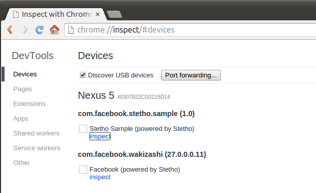
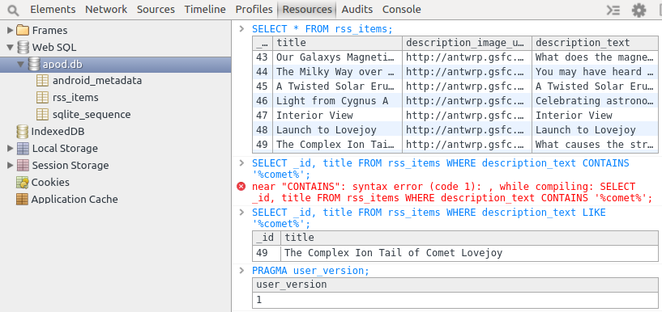

使用Chrome调试App
===

Facebook 开源工具 [Stetho](http://facebook.github.io/stetho/)，可实现 Chrome 调试 Android App。

### 配置步骤

- 先在 Gradle 中添加依赖：

```java
dependencies {
    compile 'com.facebook.stetho:stetho:1.0.1'
}
```
- 然后在 App 的 Application 类中配置：

```java
public class MyApplication extends Application {
    public void onCreate() {
        super.onCreate();
        Stetho.initialize(
            Stetho.newInitializerBuilder(this)
            .enableDumpapp(Stetho.defaultDumperPluginsProvider(this))
            .enableWebKitInspector(Stetho.defaultInspectorModulesProvider(this))
            .build());
    }
}
```
- chrome 调试




### 基本功能

- 检测网络状态


- 查看 App 本地数据库且可直接执行 SQL



- 查看 App 本地 SharedPreference 且可直接编辑


### 注意事项

如果你只是简单的进行配置下，检测网络状态的是没法查看，有两种方式：

- 1.使用 OkHttp

最简单的一种方式，要求OkHttp的版本在2.2.x+，只需要添加如下代码：

```java
OkHttpClient client = new OkHttpClient();
client.networkInterceptors().add(new StethoInterceptor());
```

- 2.使用 HttpURLConnection

如果使用的请求是 HttpURLConnection 实现，需使用 StethoURLConnectionManager 进行集成。
然后声明 Accept-Encoding: gzip 的请求 headers。
详见 [stetho sample](https://github.com/stormzhang/stormzhang.github.com/blob/master/apk/stetho_sample.apk?raw=true)。

其中你可能会依赖如下network helpers.
```
dependencies {
    compile 'com.facebook.stetho:stetho-okhttp:1.0.1'
}
```

或者

```
dependencies {
    compile 'com.facebook.stetho:stetho-urlconnection:1.0.1'
}
```
