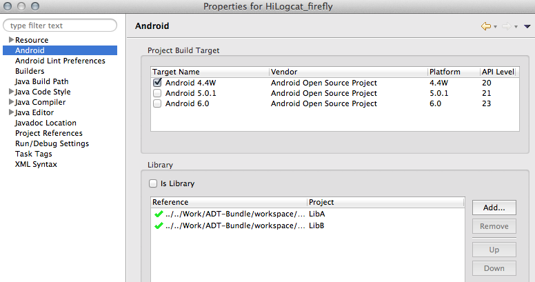

Lib工程
===

### 库工程（library project）

library project是作为jar包被其它android工程使用的，首先它也是普通的android工程。可由如下两种方式生成Lib工程：

1. 新建Android工程时指定
2. 右键指定的普通工程，Properties -> Android -> Is Library 或在project.properties中加上android.library=true

注意：作为library工程可以引用外部jar包，但不能引用其它library工程，在library工程中不能使用aidl文件，不能引用raw、assets下资源
另外当试图运行一个library工程时，eclipse将报错："Android library projects cannot be launched."

clear一下工程，会在bin目录下生成了一个Jar文件，该Jar文件包含编译后的class文件（不包含R文件）。再仔细观察Gen目录下的R文件，所有的常量都变成了变量（去掉了final关键字）。这是因为资源文件的ID在最终打包进APK文件时才会确定。所以，当一个工程被做成library工程时，只要switch case语句引用了R类，都必须改成if...else...语句（case后面只能跟常量）。

### 主工程引用库工程

当引用lib工程后，主工程就可以调用library工程的相关类和方法。android工程引用其它library工程步骤：

1. 右键主工程 -> Properties
2. 选择Android -> Add，（错误方式：Java BuildPath -> Projects -> Add）

### 在主工程manifest.xml文件中声明lib工程的组件

主工程manifest.xml中必须添加：

1. library工程的所有Activity、Service、receiver、provider，
2. library工程的permission、uses-library等属性，

注意引用的组件要使用完全的包名，否则将报对应的NotFoundException。

### 库工程与主工程资源冲突问题

当运行有引用library工程的android工程时，android工具将会合并library工程与主工程的所有资源。如果一个资源ID将有可能在library工程之间或library工程、主工程之间都有定义，这时候优先级别高的资源ID将覆盖优先级别低的，使用资源时将使用优先级别最高的工程的资源，子工程中的资源文件无法打包到APK中。

上图的资源优先级如下：主工程 > LibA > LibB。（注：library工程之间可手动调整优先级）

此外，可参考android-support-v7-appcompat项目，再建一个工程base-lib，将Jar包拷贝到base-lib工程的libs目录下，再将base中所有的资源文件拷贝到base-lib中，然后只需要把base-lib添加到A工程就行了，就像添加base工程一样。这种方式很适合对外发布Android API。

主工程打包时，android sdk版本使用的是主工程。所以library工程使用的android sdk版本不高于主工程的sdk版本。如果library工程sdk版本高于主工程，将不能通过编译。

### Lib工程和Jar包区别

将Android工程打包成jar包，那么其他工程就能够直接引用了。但如果工程中使用到了res里面的资源文件（也就是引用了R.java），由于R.java里面的是自动生成的，并且是动态的，做成jar包后，内部的资源便无法使用。
