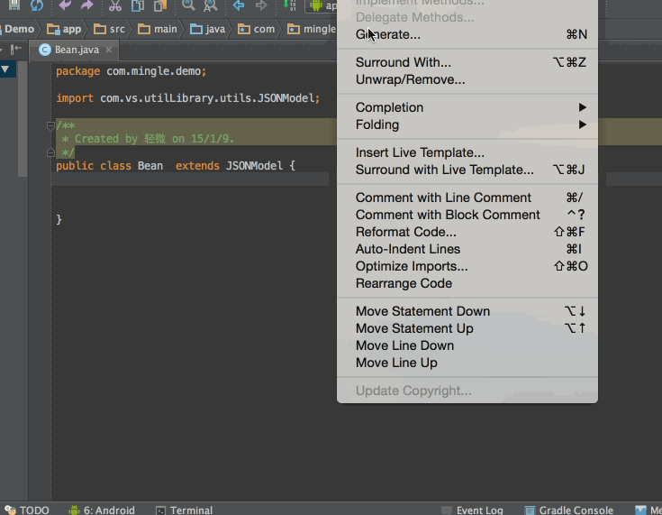

Android Studio Tools
===

### 插件安装

```
在线安装：
打开Android Studio --> preferences/Settings-> Plugins-> Browse Repositories
本地安装：
打开Android Studio --> preferences/Settings-> Plugins-> install plugin form disk
```

### 1、[ButterKnife Zelezny](https://github.com/avast/android-butterknife-zelezny)
ButterKnife 生成器，使用起来非常简单方便，不知道ButterKnife的赶紧去我的博客搜下


### 2、[SelectorChapek](https://github.com/inmite/android-selector-chapek)
设计师给我们提供好了各种资源，每个按钮都要写一个selector是不是很麻烦？现在只需要做的是告诉设计师们按照规范命名，其他一键搞定。


### 3、[GsonFormat](https://github.com/zzz40500/GsonFormat)
现在大多数服务端api都以json数据格式返回，而客户端需要根据api接口生成相应的实体类，这个插件把这个过程自动化了，赶紧使用起来吧。



### 4、[ParcelableGenerator](https://github.com/mcharmas/android-parcelable-intellij-plugin)
Android中的序列化有两种方式，分别是实现Serializable接口和Parcelable接口，但在Android中是推荐使用Parcelable。


### 5、[LeakCanary](https://github.com/square/leakcanary)
Square最近刚开源的一个非常有用的工具，强烈推荐，帮助你在开发阶段方便的检测出内存泄露的问题。


[LeakCanary 中文使用说明](http://www.liaohuqiu.net/cn/posts/leak-canary-read-me/)

### 6、[Android WiFi ADB](https://github.com/pedrovgs/AndroidWiFiADB)
安装重启Android Studio，第一次需要数据线连接，提示连接成功之后，即可拔掉数据线。


### 其他
```
https://github.com/googlesamples
Android系统每次推出一些新特性，Google都会写一些Demo放在Github上，对于想要了解新特性怎么玩的同学，肯定不能错过它。

https://www.codota.com/
如果你不知道一个Android的类怎么用，可以在Codota上面快速的找到很多不错的示例代码。

https://android-arsenal.com/
你是否还在为找不到合适的开源库而苦恼，Android Arsenal这个网站已经帮你做了一定的分类，可以帮你提高不少效率。

https://android.googlesource.com/
Android所有的源代码都在这里，只需找到对应想要的模块，用Git克隆下来即可。比如，我想要的framework代码。

http://androidxref.com/
克隆Android一个模块的代码量是很多的，有时候我只想要几个类的代码怎么办？AndroidXRef这个网站可以让你单独搜索某个类，要哪几个下载哪几个即可。

http://grepcode.com/
除了AndroidXRef可以查看某个类的源代码外，GrepCode同样也能做到。而且GrepCode不限于Android的源码，这里也推荐一下。


源码分析

http://a.codekk.com/
国内Android源码分析的先驱，由滴滴的技术专家Trinea发起，坦白的讲，这个项目对我的影响很大，我也从这里开始体会源码解读的魅力的。

http://0xcc0xcd.com/p/index.php
老罗，罗升阳的个人博客站点，很多人看过他博客里面是如何分析Android和Chrome的源代码的。

http://gityuan.com/
GitYuan，MIUI系统工程师，他的博客经常分享Android系统源码解读的文章，质量很高。而且，更新频率也很高！

https://github.com/LittleFriendsGroup/AndroidSdkSourceAnalysis
CJJ，猪场（网易）的开发者，由他带领发起的Android SDK源码解析，同样推荐。


动画
https://github.com/airbnb/lottie-android
Airbnb开源的动画库，为什么推荐它，是因为它让复杂酷炫的动画效果轻松实现了，不仅提高工程师的效率而且性能非常客观。

Crash搜集
https://bugly.qq.com
Bugly，腾讯出品的SDK，对Crash搜集的体验非常赞，能搜集到JNI层的奔溃以及监控线上的ANR问题。

https://try.crashlytics.com/
Crashlytics，国外的一个SDK，我自己没用过，但是用过的朋友对它的评价颇高。

https://github.com/ACRA/acra
ARCA，一个开源的崩溃日志搜集器，轻松让你实现客户端的崩溃日志上传到后台，如果你不喜欢接入别人家的SDK，可以使用它。有一个不足之处，就是它搜集不到JNI层的奔溃。


逆向分析
逆向分析工具太多，举几个经典的做例子。

https://github.com/skylot/jadx/
Jdax，轻轻一下，立马让apk宽衣解带，下面是我拿知乎开刀的例子。


https://github.com/google/android-classyshark
Classyshark，轻松查看apk内部每个包的方法数，用了哪些开源库，同样拿知乎开刀做例子。


https://github.com/JesusFreke/smali/wiki/smalidea
smali代码调试插件，你以为没有拿到安卓Java源码就不能调试了吗？图样图森破了吧。


https://www.hex-rays.com/products/ida/
IDA Pro，逆向大利器，不管你是smali还是so文件，照样动态调试你。


调试利器
http://facebook.github.io/stetho/
Stetho，来自Facebook，它能做什么？无需root，借助Chrome可以查看SharePreferences和数据库中的数据，此外还有网络抓包以及查看View树等。


性能优化
http://hukai.me/
胡凯，腾讯开发者，翻译了一系列的Google Android性能优化典范的文章。

https://hujiaweibujidao.github.io/
Hujiawei，魅族开发者，博客最近经常更新Android性能数据搜集统计的相关的文章，本人受益匪浅。

apkpure
https://apkpure.com/
这个是用来下载第三方应用的，无需Google play 即可下载 play 商店里的各种应用

当前Activity
https://github.com/109021017/android-TopActivity
该款软件可浮现透明框显示最前台页面所在应用的包名及Activity

还有一个脚本来获取

#!/bin/sh
oldActvity=""
displayName=""
currentActivity=`adb shell dumpsys window windows | grep -E 'mCurrentFocus'`
while true
do
    if [[ $oldActvity != $currentActivity && $currentActivity != *"=null"* ]]; then
        displayName=${currentActivity##* }
        displayName=${displayName%%\}*}
        echo $displayName
        oldActvity=$currentActivity
    fi
    currentActivity=`adb shell dumpsys window windows | grep -E 'mCurrentFocus'`
done


ActivityLauncher
https://github.com/jp1017/ActivityLauncher
该款软件显示每个应用的Activity，点击Activity可直达该界面，部分因权限问题导致打开失败。Android Studio直接编译运行。


MLManager
https://github.com/javiersantos/MLManager
该款软件是一个95年的西班牙朋友写的，只要用来提取apk到本地，分享apk。

开发助手
http://www.trinea.cn/android/android-develop-and-debug-tools-1-4-0-system-ui-tuner/
https://apkpure.com/dev-tools/cn.trinea.android.developertools
滴滴大神 Trinea 开发的一款快速调试及查看手机信息的应用

packagehunter
https://github.com/nisrulz/packagehunter
easydeviceinfo 作者的又一神器，包猎手，快速分析一款软件所包含的各种组件

Native Libs Monitor
https://apkpure.com/search?q=Native+Libs+Monitor
分析一款应用内所包含的所有so库及该手机所使用的so库

安全码校验
获取一款软件的SHA1签名，使用百度地图，高德地图时常因签名问题导致地图不显示，可用此查看对比。
当然也可以直接用代码查看：AndroidUtilCode#56
https://github.com/Blankj/AndroidUtilCode/pull/56/files
```