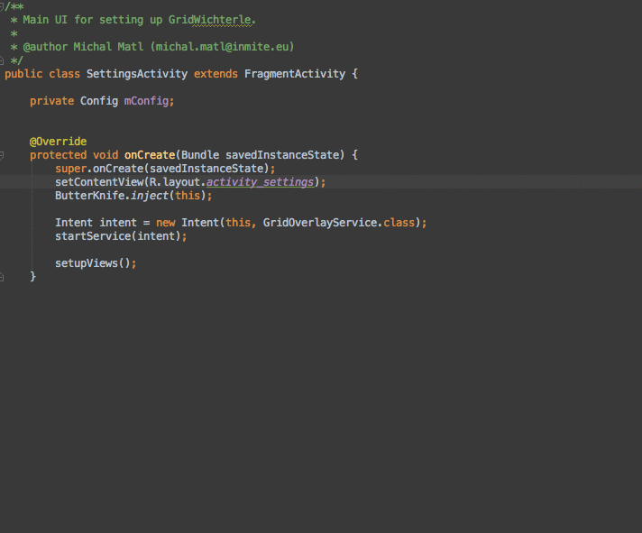
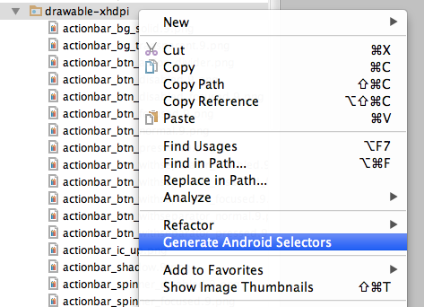
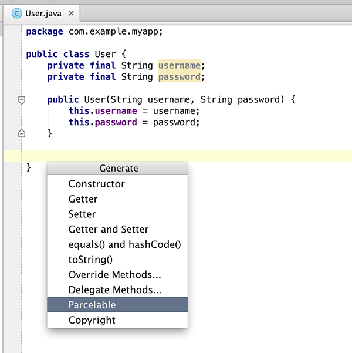
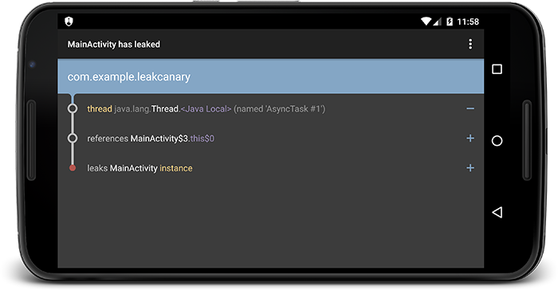

Android Studio Tools
===

1、ButterKnife Zelezny
ButterKnife 生成器，使用起来非常简单方便，不知道ButterKnife的赶紧去我的博客搜下

2、SelectorChapek
设计师给我们提供好了各种资源，每个按钮都要写一个selector是不是很麻烦？这么这个插件就为解决这个问题而生，你只需要做的是告诉设计师们按照规范命名就好了，其他一键搞定。

3、GsonFormat
现在大多数服务端api都以json数据格式返回，而客户端需要根据api接口生成相应的实体类，这个插件把这个过程自动化了，赶紧使用起来吧。

4、ParcelableGenerator
Android中的序列化有两种方式，分别是实现Serializable接口和Parcelable接口，但在Android中是推荐使用Parcelable，只不过我们这种方式要比Serializable方式要繁琐，那么有了这个插件一切就ok了。

5、LeakCanary
良心企业Square最近刚开源的一个非常有用的工具，强烈推荐，帮助你在开发阶段方便的检测出内存泄露的问题，使用起来更简单方便，而且我们团队第一时间使用帮助我们发现了不少问题。

[LeakCanary 中文使用说明](http://www.liaohuqiu.net/cn/posts/leak-canary-read-me/)
