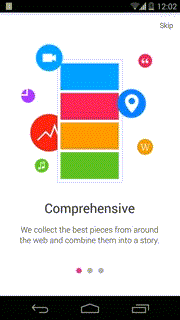
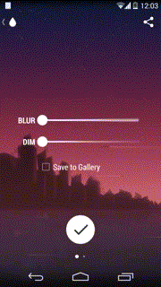
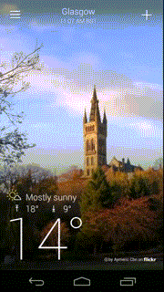

ViewPager.PageTransformer
===

通过ViewPager实现应用进入动画，且View中的元素也在移动，如下：




实现方法：

```java
mPager.setPageTransformer(false, new ViewPager.PageTransformer() {
    @Override
    public void transformPage(View view, float position) {
        // ....
    }
    });
```

其中transformPage()的实现如下：

```java
public void transformPage(View view, float position) {
    int pageWidth = view.getWidth();

    if (position < -1) { // [-Infinity,-1)
        // This page is way off-screen to the left.
        view.setAlpha(0);
        } else if (position <= 1) { // [-1,1]
            mBlur.setTranslationX((float) (-(1 - position) * 0.5 * pageWidth));
            mBlurLabel.setTranslationX((float) (-(1 - position) * 0.5 * pageWidth));

            mDim.setTranslationX((float) (-(1 - position) * pageWidth));
            mDimLabel.setTranslationX((float) (-(1 - position) * pageWidth));

            mCheck.setTranslationX((float) (-(1 - position) * 1.5 * pageWidth));
            mDoneButton.setTranslationX((float) (-(1 - position) * 1.7 * pageWidth));
            // The 0.5, 1.5, 1.7 values you see here are what makes the
            // view move in a different speed.
            // The bigger the number, the faster the view will translate.
            // The result float is preceded by a minus because the views
            // travel in the opposite direction of the movement.

            mFirstColor.setTranslationX((position) * (pageWidth / 4));
            mSecondColor.setTranslationX((position) * (pageWidth / 1));
            mTint.setTranslationX((position) * (pageWidth / 2));
            mDesaturate.setTranslationX((position) * (pageWidth / 1));
            // This is another way to do it

            } else { // (1,+Infinity]
                // This page is way off-screen to the right.
                view.setAlpha(0);
            }
        }
    }
}
```

雅虎天气应用效果：




```java
public class ParallaxPageTransformer implements ViewPager.PageTransformer {

    public void transformPage(View view, float position) {
        int pageWidth = view.getWidth();
        if (position < -1) { // [-Infinity,-1)
            // This page is way off-screen to the left.
            view.setAlpha(1);
            } else if (position <= 1) { // [-1,1]  
                dummyImageView.setTranslationX(-position * (pageWidth / 2)); //Half the normal speed
                } else { // (1,+Infinity]
                    // This page is way off-screen to the right.
                    view.setAlpha(1);
                }
            }
        }
    }
}
```
