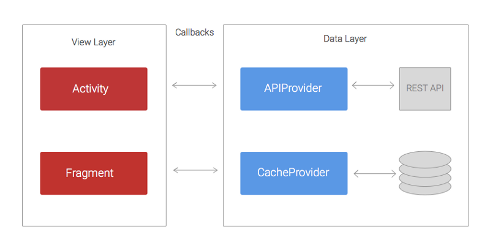
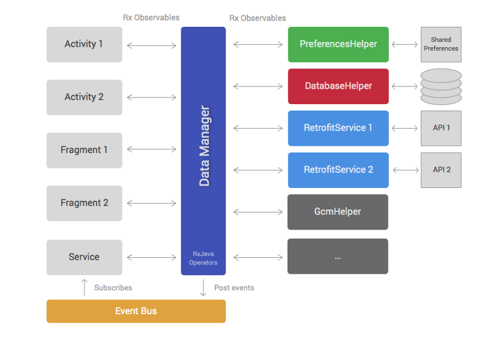

Android Application architecture
===

The Android dev ecosystem moves very quickly. Every week new tools are created, libraries are updated, blog posts are written and talks are given. If you go on holiday for a month, by the time you come back there will be a new version of the support library and/or Play Services.

I’ve been making Android apps with the ribot team for over three years. During this time, the architecture and technologies we’ve used to build Android apps have been continuously evolving. This article will take you through this journey by explaining our learnings, mistakes and the reasoning behind these architectural changes.

### The old times
Back in 2012 our codebases used to follow a basic structure. We didn’t use any networking library and AsyncTasks were still our friends. The diagram below shows approximately how the architecture was.

### Initial architecture
The code was structured in two layers: the data layer that was in charge of retrieving/saving data from REST APIs and persistent data stores; and the view layer, whose responsibility was handling and displaying the data on the UI.
The APIProvider provides methods to enable Activities and Fragments to easily interact with the REST API. These methods use URLConnection and AsyncTasks to perform network calls in a separate thread and return the result to the Activities via callbacks.

In a similar way, the CacheProvider contains methods that retrieve and store data from SharedPreferences or a SQLite database. It also uses callbacks to pass the result back to the Activities.

### The problems
The main issue with this approach was that the View layer had too many responsibilities. Imagine a simple common scenario where the application has to load a list of blog posts, cache them in a SQLite database and finally display them on a ListView. The Activity would have to do the following:

1. Call a method loadPosts(callback) in the APIProvider
2. Wait for the APIProvider success callback and then call savePosts(callback) in the CacheProvider.
3. Wait for the CacheProvider success callback and then display the posts on the ListView.
4. Separately handle the two potential errors callback from the APIProvider and CacheProvider.

This is a very simple example. In a real case scenario the REST API will probably not return the data like the view needs it. Therefore, the Activity will have to somehow transform or filter the data before showing it. Another common case is when the loadPosts() method takes a parameter that needs to be fetched from somewhere else, for example an email address provided by the Play Services SDK. It’s likely that the SDK will return the email asynchronously using a callback, meaning that we now have three levels of nested callbacks. If we keep adding complexity, this approach will result into what is known as callback hell.

In summary:

1. Activities and Fragments become very large and difficult to maintain
2. Too many nested callbacks means the code is ugly and difficult to understand so painful to make changes or add new features.
3. Unit testing becomes challenging, if not impossible, because a lot of the logic lives within the Activities or Fragments that are arduous to unit test.

### A new architecture driven by RxJava

We followed the previous approach for about two years. During that time, we made several improvements that slightly mitigated the problems described above. For example, we added several helper classes to reduce the code in Activities and Fragments and we started using Volley in the APIProvider. Despite these changes, our application code wasn’t yet test-friendly and the callback hell issue was still happening too often.

It wasn’t until 2014 when we started reading about [RxJava](http://reactivex.io/). After trying it on a few sample projects, we realised that this could finally be the solution to the nested callback problem. If you are not familiar with reactive programming you can [read this introduction](https://gist.github.com/staltz/868e7e9bc2a7b8c1f754). In short, RxJava allows you to manage data via asynchronous streams and gives you many [operators](http://reactivex.io/documentation/operators.html) that you can apply to the stream in order to transform, filter or combine the data.

Taking into account the pains we experienced in previous years, we started to think about how the architecture of a new app would look. So we came up with this.

### RxJava-driven architecture

Similar to the first approach, this architecture can be separated into a data and view layer. The data layer contains the DataManager and a set of helpers. The view layer is formed by Android framework components like Fragments, Activities, ViewGroups, etc.

Helper classes (third column on diagram) have very specific responsibilities and implement them in a concise manner. For example, most projects have helpers for accessing REST APIs, reading data from databases or interacting with third party SDKs. Different applications will have a different number of helpers but the most common ones are:

1. PreferencesHelper: reads and saves data in SharedPreferences.
2. DatabaseHelper: handles accessing SQLite databases.
3. [Retrofit](https://github.com/square/retrofit )services: perform calls to REST APIs. We started using Retrofit instead of Volley because it provides support for RxJava. It’s also nicer to use.

Most of the public methods inside helper classes will return RxJava Observables.

The DataManager is the brain of the architecture. It extensively uses RxJava operators to combine, filter and transform data retrieved from helper classes. The aim of the DataManager is to reduce the amount of work that Activities and Fragments have to do by providing data that is ready to display and won’t usually need any transformation.
The code below shows what a DataManager method would look like. This sample method works as follows:

1. Call the Retrofit service to load a list of blog posts from a REST API
2. Save the posts in a local database for caching purposes using the DatabaseHelper.
3. Filter the blog posts written today because those are the only ones the view layer wants to display.

Components in the view layer such as Activities or Fragments would simply call this method and subscribe to the returned Observable. Once the subscription finishes, the different Posts emitted by the Observable can be directly added to an Adapter in order to be displayed on a RecyclerView or similar.

The last element of this architecture is the event bus. The event bus allows us to broadcast events that happen in the data layer, so that multiple components in the view layer can subscribe to these events. For example, a signOut() method in the DataManager can post an event when the Observable completes so that multiple Activities that are subscribed to this event can change their UI to show a signed out state.

### Why was this approach better?

1. RxJava Observables and operators remove the need for having nested callbacks.
2. The DataManager takes over responsibilities that were previously part of the view layer. Hence, it makes Activities and Fragments more lightweight.
3. Moving code from Activities and Fragments to the DataManager and helpers means that writing unit tests becomes easier.
4. Clear separation of responsibilities and having the DataManager as the only point of interaction with the data layer, makes this architecture test-friendly. Helper classes or the DataManager can be easily mocked.

### What problems did we still have?

1. For large and very complex projects the DataManager can become too bloated and difficult to maintain.
2. Although view layer components such as Activities and Fragments became more lightweight, they still have to handle a considerable amount of logic around managing RxJava subscriptions, analysing errors, etc.

### Integrating Model View Presenter(MVP)

In the past year, several architectural patterns such as [MVP](https://en.wikipedia.org/wiki/Model%E2%80%93view%E2%80%93presenter) or [MVVM](https://en.wikipedia.org/wiki/Model%E2%80%93view%E2%80%93viewmodel) have been gaining popularity within the Android community. After exploring these patterns on a [sample project](https://github.com/ivacf/archi) and [article](https://medium.com/ribot-labs/approaching-android-with-mvvm-8ceec02d5442#.x98dqfu6m), we found that MVP could bring very valuable improvements to our existing approach. Because our current architecture was divided in two layers (view and data), adding MVP felt natural. We simply had to add a new layer of presenters and move part of the code from the view to presenters.

The data layer remains as it was but it’s now called model to be more consistent with the name of the pattern.

Presenters are in charge of loading data from the model and calling the right method in the view when the result is ready. They subscribe to Observables returned by the data manager. Therefore, they have to handle things like [schedulers](http://reactivex.io/documentation/scheduler.html) and [subscriptions](http://reactivex.io/RxJava/javadoc/rx/Subscription.html). Moreover, they can analyse error codes or apply extra operations to the data stream if needed. For example, if we need to filter some data and this same filter is not likely to be reused anywhere else, it may make more sense to implement it in the presenter rather than in the data manager.

Below you can see what a public method in the presenter would look like. This code subscribes to the Observable returned by the dataManager.loadTodayPosts() method we defined in the previous section.

The mMvpView is the view component that this presenter is assisting. Usually the MVP view is an instance of an Activity, Fragment or ViewGroup.

Like the previous architecture, the view layer contains standard framework components like ViewGroups, Fragments or Activities. The main difference is that these components don’t subscribe directly to Observables. They instead implement an MvpView interface and provide a list of concise methods such as showError() or showProgressIndicator(). The view components are also in charge of handling user interactions such as click events and act accordingly by calling the right method in the presenter. For example, if we have a button that loads the list of posts, our Activity would call presenter.loadTodayPosts() from the onClick listener.

If you want to see a full working sample of this MVP-based architecture, you can check out our [Android Boilerplate project on GitHub](https://github.com/ribot/android-boilerplate). You can also read more about it in the ribot’s architecture [guidelines](https://github.com/ribot/android-guidelines/blob/master/architecture_guidelines/android_architecture.md).

### Why is this approach better?

1. Activities and Fragments become very lightweight. Their only responsibilities are to set up/update the UI and handle user events. Therefore, they become easier to maintain.
2. We can now easily write unit tests for the presenters by mocking the view layer. Before, this code was part of the view layer so we couldn’t unit test it. The whole architecture becomes very test-friendly.
3. If the data manager is becoming bloated, we can mitigate this problem by moving some code to the presenters.

### What problems do we still have?

Having a single data manager can still be an issue when the codebase becomes very large and complex. We haven’t reached the point where this is a real problem but we are aware that it could happen.

It’s important to mention that this is not the perfect architecture. In fact, it’d be naive to think there is a unique and perfect one that will solve all your problems forever. The Android ecosystem will keep evolving at a fast pace and we have to keep up by exploring, reading and experimenting so that we can find better ways to continue building excellent Android apps.

I hope you enjoyed this article and you found it useful. If so, don’t forget to click the recommend button. Also, I’d love to hear your thoughts about our latest approach.
