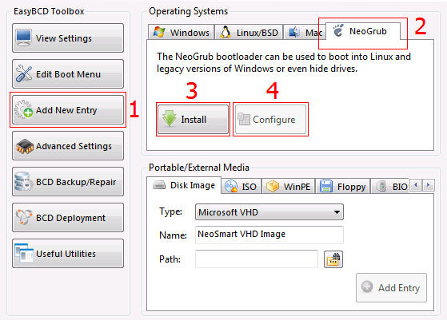
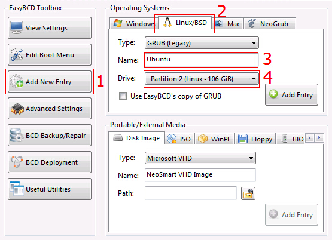

Win7硬盘安装Ubuntu
===

### 准备工具

1. EasyBCD 2.2
2. Ubuntu 12.04
3. 在Windows下预留一个带分配的空间，删除某一分区即可，或在安装Ubuntu进行分区时再删除也可
4. 将Ubuntu的镜像文件iso解压，将casper目录下initrd.lz、vmlinuz.efi(如果是32位，为vmlinuz)，以及该iso，放入C盘根目录。

### 添加NeoGrubBootloader



编辑弹出的menu.lst：

```
title Install Ubuntu
root (hd0,0)
kernel (hd0,0)/vmlinuz.efi boot=casper iso-scan/filename=/ubuntu-12.04-desktop-amd64.iso ro quiet splash locale=zh_CN.UTF-8
initrd (hd0,0)/initrd.lz
```

注：XXX.iso为下载的镜像，(hd0,0) 为Win7系统分区，可在计算机管理--磁盘管理中看系统盘符索引。

### 启动Ubuntu Live

重启电脑，启动菜单会多了一项NeoGrubBootloader，选择后会进入Ubuntu Live，先需要解除挂载的硬盘系统，在命令行中输入：

```
sudo umount -l /isodevice
```

### 安装Ubuntu

选安装类型为“其他类型”。这样可以自己创建、调整分区、或者为 Ubuntu 选择多个分区。
分区方案：

```
/     20G   ext4  # Ubuntu根分区
swap  4G          # 一般大小设为内存两倍
/home XXG   ext4  # 剩下的硬盘空间
```
注意该页面中选择安装启动引导器的设备为根分区（/）所在的设备符如/dev/sda6。不要可接选择硬盘，否则Grub会覆盖EasyBCD，不得不自行修复MBR。

### 安装Ubuntu引导项

安装完成后，机器引导项里并没有Ubuntu，可先进入Windows，在EasyBCD里添加。



drive 选择ubuntu根目录盘符。添加后可以自行配置默认启动项，删除NeoGrubBootloader。

### 完成后配置（更新）

- 配置vim
- 输入法，目前[搜狗输入法](http://pinyin.sogou.com/linux/)已支持linux版本
- chrome，vimium等插件
- git
- 添加163源
- go
- python
- docker
- Android Studio 配置JDK
```
sudo add-apt-repository ppa:webupd8team/java
sudo apt-get update
sudo apt-get install oracle-java7-installer     # or oracle-java6-installer
```
