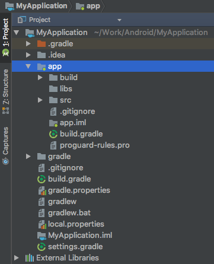

Gradle简介
===

### 一、什么是Gradle

Gradle是一个构建工具，Android Studio中默认就使用Gradle构建App。构建包括编译、打包等过程。可为Gradle自定义构建规则，满足个性化的构建需求。本系类总结也默认以Android项目作为上下文。

 
### 二、Gradle的基本组分

1. Project与Task

在Gradle中，最重要的两个概念是工程（Project）和任务（Task），每个build.gradle就是一个工程。每次构建至少包括一个Project，每一个Project包括一个或者多个Task，因此，Android中每一个待构建的工程是一个Project，构建一个Project需要执行一系列Task，比如编译、打包这些构建过程的子过程都对应着一个Task。具体来说，一个apk文件的构建包含以下Task：Java源码编译、资源文件编译、Lint检查、打包以生成最终的apk文件等等。

 

2. 插件

在一个项目中应用一个插件，该项目就可以使用该插件预定义的属性和任务。插件的核心工作有两个：一是定义Task；二是执行Task。

在新建工程的app模块的build.gradle文件的第一行，往往都是如下这句：
```groovy
apply plugin: 'com.android.application'
```
意思是用该插件构建app模块，app模块就是Gradle中的一个Project。也就是说，这个插件负责定义并执行Java源码编译、资源文件编译、打包等一系列Task。

实际上"com.android.application"整个插件中定义了如下4个顶级任务：

- assemble: 构建项目的输出（apk）
- check: 进行校验工作
- build: 执行assemble任务与check任务
- clean: 清除项目的输出

当我们执行一个任务时，会自动执行它所依赖的任务。比如，执行assemble任务会执行assembleDebug任务和assembleRelease任务，这是因为一个Android项目至少要有debug和release这两个版本的输出。

此外，如果构建的不是app，而是依赖库，需声明“com.android.library”。不可在同一个模块中同时使用这两个插件，会导致构建错误。
 

3. Gradle配置文件

我们在Android Studio中新建一个工程，可以得到如下的工程结构图：


上文说过，Android Studio中的一个Module即为Gradle中的一个Project。上图的app目录下，存在一个build.gradle文件，代表了app Module的构建脚本，它定义了应用于本模块的构建规则。我们可以看到，工程根目录下也存在一个build.gradle文件，它代表了整个工程的构建，其中定义了适用于这个工程中所有模块的构建规则。

接下来我们介绍一下上图中其他几个Gradle配置文件：

gradle.properties: 从它的名字可以看出，这个文件中定义了一系列“属性”。实际上，这个文件中定义了一系列供build.gradle使用的常量，比如keystore的存储路径、keyalias等等。

gradlew与gradlew.bat: gradlew为Linux下的shell脚本，gradlew.bat是Windows下的批处理文件。gradlew是gradle wrapper的缩写，也就是说它对gradle的命令进行了包装，比如我们进入到指定Module目录并执行“gradlew.bat assemble”即可完成对当前Module的构建（Windows系统下）。

local.properties: 从名字就可以看出来，这个文件中定义了一些本地属性，比如SDK的路径。

settings.gradle: 假如我们的项目包含了不只一个Module时，我们想要一次性构建所有Module以完成整个项目的构建，这时我们需要用到这个文件。如项目包含了ModuleA和ModuleB这两个模块：

include ':ModuleA', ':ModuleB'。

 

4. 构建脚本

工程目录下的build.gradle，指定了真个整个项目的构建规则，内容如下：

```groovy
buildscript {
    repositories {
        jcenter() //构建脚本中所依赖的库都在jcenter仓库下载
    }
    dependencies {
        // 指定了android gradle插件的版本
        classpath 'com.android.tools.build:gradle:1.5.0'
    }
}

allprojects {
    repositories {
        // 当前项目所有模块所依赖的库都在jcenter仓库下载
        jcenter()
    }
}
```

app模块的build.gradle内容：

```groovy
// 加载用于构建Android项目的插件
apply plugin: 'com.android.application'

android { // 构建Android项目使用的配置
    compileSdkVersion 23 // 指定编译项目时使用的SDK版本
    buildToolsVersion "23.0.1" // 指定构建工具的版本

    defaultConfig {
        applicationId "com.absfree.debugframwork" //包名
        minSdkVersion 15  // 指定支持的最小SDK版本
        targetSdkVersion 23 // 针对的目标SDK版本
        versionCode 1 
        versionName "1.0"
    }
    buildTypes { // 针对不同的构建版本进行一些设置
        release { // 对release版本进行的设置
            minifyEnabled false // 是否开启混淆
            proguardFiles getDefaultProguardFile('proguard-android.txt'), 'proguard-rules.pro'  // 指定混淆文件的位置
        }
    }
}

dependencies { // 指定当前模块的依赖
    compile fileTree(dir: 'libs', include: ['*.jar'])
    testCompile 'junit:junit:4.12'
    compile 'com.android.support:appcompat-v7:23.1.1'
    compile 'com.android.support:design:23.1.1'
}
```

 

### 三、常见配置

整个工程的build.gradle通常不需我们改动，这里我们介绍下一些对模块目录下build.gradle文件的常见配置。


1. 依赖第三方库

当我们的项目中用到了了一些第三方库时，我们就需要进行一些配置，以保证能正确导入相关依赖。设置方法很简单，比如我们在app模块中用到了Fresco，只需要在build.gradle文件中的dependencies块添加如下语句：

```groovy
dependencies {
    ...
    compile 'com.facebook.fresco:fresco:0.11.0'
}
```

这样一来，Gradle会自动从jcenter仓库下载我们所需的第三方库并导入到项目中。

 

2. 导入本地jar包

在使用第三方库时，除了像上面那样从jcenter仓库下载，我们还可以导入本地的jar包。配置方法也很简单，只需要先把jar文件添加到app\libs目录下，然后在相应jar文件上单击右键，选择“Ad As Library”。然后在build.gradle的dependencies块下添加如下语句：

 
```groovy
compile files('libs/xxx.jar')
```

实际上我们可以看到，系统为我们创建的build.gradle中就已经包含了如下语句：

```groovy
compile fileTree(dir: 'libs', include: ['*.jar'])
 ```

表示将libs目录下的所有jar包都导入。所以实际上我们只需要把jar包添加到libs目录下并“Ad As Library"即可。


3. 依赖其它模块

假设我们的项目包含了多个模块，并且app模块依赖other模块，那么我们只需app\build.gradle的denpendencies块下添加如下语句：

```groovy
compile project(':other')
```
 

4. 构建输出为aar文件

通常构建的输出目标都是apk文件，如果当前项目是Android Library，目标输出是aar文件。需要把build.gradle的第一句改为如下：

```groovy
apply plugin:'com.android.library'
```

表示使用的插件不再是构建Android应用的插件，而是构建Android Library的插件，这个插件定义并执行用于构建Android Library的一系列Task。

 

5. 自动移除不再使用的资源

只需进行如下配置：

```groovy
android {
    ...
    }
    buildTypes {
        release {
            ...
            shrinkResources true
            ...
        }
    }
}
```

6. 忽略Lint错误

在我们构建Android项目的过程中，有时候会由于Lint错误而终止。当这些错误来自第三方库中时，我们往往想要忽略这些错误从而继续构建进程。这时候，我们可以只需进行如下配置：

```groovy
android {
    ...
    lintOptions {
        abortOnError false
    }
}
```

7. 集成签名配置

在构建release版本的Android项目时，每次都手动导入签名文件，键入密码、keyalias等信息十分麻烦。通过将签名配置集成到构建脚本中，我们就不必每次构建发行版本时都手动设置了。具体配置如下：

```groovy
signingConfigs {
    myConfig { //将"xx"替换为自己的签名文件信息
        storeFile file("xx.jks")
        storePassword "xx"
        keyAlias "xx"
        keyPassword "xx"
    }
}
android {
    buildTypes {
        release {
            signingConfig  signingConfigs.myConfig //在release块中加入这行
            ...
        }
    }
    ...
}
```

真实开发中，我们不应该把密码等信息直接写到build.gradle中，更好的做法是放在gradle.properties中设置：

```groovy
RELEASE_STOREFILE=xxx.jks 
RELEASE_STORE_PASSWORD = xxx
RELEASE_KEY_ALIAS=xxx
RELEASE_KEY_PASSWORD=xxx
```

然后在build.gradle中直接引用即可：

```groovy
signingConfigs {
    myConfig { 
        storeFilefile(RELEASE_STOREFILE)
        storePassword RELEASE_STORE_PASSWORD
        keyAlias RELEASE_KEY_ALIAS
        keyPassword RELEASE_KEY_PASSWORD 
    }
}
```


### 四、附录

1. 深入理解Android之Gradle:http://blog.csdn.net/Innost/article/details/48228651
    
    从原理到使用非常深入细致地介绍了Gradle。而且重点介绍了怎样把Gradle当做一个编程框架来使用，介绍了Groovy语法基础、Gradle常用API


2. Gradle构建最佳实践: http://www.figotan.org/2016/04/01/gradle-on-android-best-practise/
    
    主要从使用者的角度介绍了Gradle在使用过程中的最佳实践
