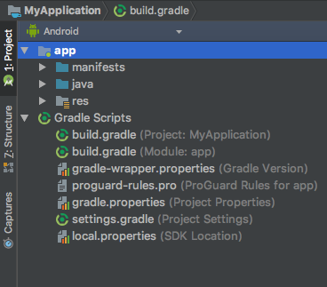
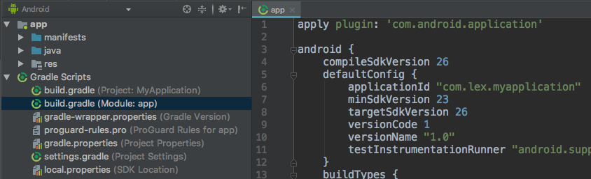
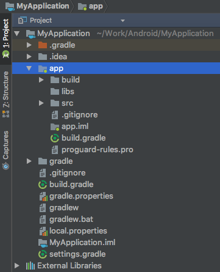

Gradle简介
===

### Project与Task

Gradle是一个构建工具，Android Studio中默认使用Gradle构建App：Java源码编译、资源文件编译、Lint检查、打包成最终的apk文件等。



用Android Studio建立一个默认的工程时，自动建立了一个名字为app的默认Module。一个Android Studio工程会有一个工程级别的build.gradle文件，定义了使用该工程所有Module的构建规则。如果有N个Module，就会有N个Module级别的build.gradle文件，对应相应模块的构建规则，子Module的设置会覆盖整个工程build.gradle的设置。上例中，有两个build.gradle文件和一个settings.gradle文件:

- Android Studio工程目录结构中一个Project可以有多个Module
- Project可以理解为Eclipse下的一个Workspace
- Module可以理解为Eclipse下的Project
- build.gradle(Project: MyApplication)文件是整个工程的build文件
- build.gradle(Module: app)文件是工程下的一个Module的build文件
- settings.gradle用于配置project，标明其下有几个module，比如这里包含一个app module：include ':app'


### 插件

在一个项目中应用一个插件，即可使用该插件预定义的属性和任务。



app Module中的build.gradle首行声明具体使用的插件：
```groovy
apply plugin: 'com.android.application'
```
该插件意思是该Module用于构建app：Java源码编译、资源文件编译、打包等一系列Task。实际上"com.android.application"整个插件中定义了如下4个顶级任务：

- assemble: 构建项目的输出（apk）
- check: 进行校验工作
- build: 执行assemble任务与check任务
- clean: 清除项目的输出

当执行一个任务时，会自动执行它所依赖的任务。如执行assemble任务会执行assembleDebug任务和assembleRelease任务，这是因为一个Android项目默认有debug和release这两个版本的输出。

此外，如果构建的不是app而是依赖库，则声明“com.android.library”。不可在同一个模块中同时使用这两个插件，会导致构建错误。


上里的工程结果如果按照Project分类，截图如下：



gradle.properties: 从它的名字可以看出，这个文件中定义了一系列“属性”。实际上，这个文件中定义了一系列供build.gradle使用的常量，比如keystore的存储路径、keyalias等等。

gradlew与gradlew.bat: gradlew为Linux下的shell脚本，gradlew.bat是Windows下的批处理文件。gradlew是gradle wrapper的缩写，允许客户端无须安装即可运行Gradle，也就是说它对gradle的命令进行了包装，进入指定Module目录并执行如下命名，即可完成对指定Module的构建：

```groovy
// Win
gradlew.bat assemble

// Mac
./gradlew assemble 
```

local.properties: 定义了一些本地属性，如SDK路径。


### 构建脚本

工程目录下的build.gradle，指定了真个整个项目的构建规则，内容如下：

```groovy
buildscript {
    repositories {
        jcenter() //构建脚本中所依赖的库都在jcenter仓库下载
    }
    dependencies {
        // 指定了android gradle插件的版本
        classpath 'com.android.tools.build:gradle:1.5.0'
    }
}

allprojects {
    repositories {
        // 当前项目所有模块所依赖的库都在jcenter仓库下载
        jcenter()
    }
}
```

app Module的build.gradle：

```groovy
// 加载用于构建Android项目的插件
apply plugin: 'com.android.application'

android { // 构建Android项目使用的配置
    compileSdkVersion 23 // 指定编译项目时使用的SDK版本
    buildToolsVersion "23.0.1" // 指定构建工具的版本

    /**
     * 在defaultConfig {} 闭包中可以为所有构建变量设置默认值，这些设置可以在编译系统中动态地复写一些
     * main/AndroidManifest.xml中的属性，可以通过配置productFlavors来为不同版本的apk赋属性值
     * 比如applicationId是配置包名，versionCode是版本号，versionName是版本名称等
     * 如果没有其他的配置覆盖，就会使用这里的值
     */
    defaultConfig {
        applicationId "com.lex.myapplication" //包名
        minSdkVersion 23  // 指定支持的最小SDK版本
        targetSdkVersion 26 // 针对的目标SDK版本
        versionCode 1 
        versionName "1.0"
    }
    buildTypes { // 针对不同的构建版本进行一些设置
        release { // 对release版本进行的设置
            minifyEnabled false // 是否开启混淆
            proguardFiles getDefaultProguardFile('proguard-android.txt'), 'proguard-rules.pro'  // 指定混淆文件的位置
        }
    }

    /**
     * productFlavors {} 闭包用于定义多种定制产品，在这里为不同版本类型的产品设置构建属性，
     * 它们将覆盖defaultConfig{}中设置的相关值，Product flavors不是Gradle默认的构建设置项，一般用于
     * 多渠道或多apk打包时自定义设置，下面示例代码中设置了两个产品，分别用于免费和收费发布，
     * 这样构建出来的apk可以在同一个应用市场或同一台Android设备上同时存在
     */
    productFlavors {
        free {
            applicationId 'com.lex.myapplication.free'
        }
        paid {
            applicationId 'com.lex.myapplication.paid'
        }
    }

    /**
     * splits {} 闭包用于构建只支持特定屏幕像素密度或ABI的Android设备的apk
     */
    splits {
        // Screen density split settings
        density {
            // Enable or disable the density split mechanism
            enable false
            // Exclude these densities from splits
            exclude "ldpi", "tvdpi", "xxxhdpi", "400dpi", "560dpi"
        }
    }
}

dependencies { // 指定当前模块的依赖
    implementation fileTree(dir: 'libs', include: ['*.jar'])
    implementation 'com.android.support:appcompat-v7:26.1.0'
    implementation 'com.android.support.constraint:constraint-layout:1.0.2'
    testImplementation 'junit:junit:4.12'
    androidTestImplementation 'com.android.support.test:runner:1.0.1'
    androidTestImplementation 'com.android.support.test.espresso:espresso-core:3.0.1'
}
```

 

### 三、常见配置

整个工程的build.gradle通常不需我们改动，这里我们介绍下一些对模块目录下build.gradle文件的常见配置。


1. 依赖第三方库

当我们的项目中用到了了一些第三方库时，我们就需要进行一些配置，以保证能正确导入相关依赖。设置方法很简单，比如我们在app模块中用到了Fresco，只需要在build.gradle文件中的dependencies块添加如下语句：

```groovy
dependencies {
    ...
    compile 'com.facebook.fresco:fresco:0.11.0'
}
```

这样一来，Gradle会自动从jcenter仓库下载我们所需的第三方库并导入到项目中。

 

2. 导入本地jar包

在使用第三方库时，除了像上面那样从jcenter仓库下载，我们还可以导入本地的jar包。配置方法也很简单，只需要先把jar文件添加到app\libs目录下，然后在相应jar文件上单击右键，选择“Ad As Library”。然后在build.gradle的dependencies块下添加如下语句：

 
```groovy
compile files('libs/xxx.jar')
```

实际上我们可以看到，系统为我们创建的build.gradle中就已经包含了如下语句：

```groovy
compile fileTree(dir: 'libs', include: ['*.jar'])
 ```

表示将libs目录下的所有jar包都导入。所以实际上我们只需要把jar包添加到libs目录下并“Ad As Library"即可。


3. 依赖其它模块

假设我们的项目包含了多个模块，并且app模块依赖other模块，那么我们只需app\build.gradle的denpendencies块下添加如下语句：

```groovy
compile project(':other')
```
 

4. 构建输出为aar文件

通常构建的输出目标都是apk文件，如果当前项目是Android Library，目标输出是aar文件。需要把build.gradle的第一句改为如下：

```groovy
apply plugin:'com.android.library'
```

表示使用的插件不再是构建Android应用的插件，而是构建Android Library的插件，这个插件定义并执行用于构建Android Library的一系列Task。

 

5. 自动移除不再使用的资源

只需进行如下配置：

```groovy
android {
    ...
    }
    buildTypes {
        release {
            ...
            shrinkResources true
            ...
        }
    }
}
```

6. 忽略Lint错误

在我们构建Android项目的过程中，有时候会由于Lint错误而终止。当这些错误来自第三方库中时，我们往往想要忽略这些错误从而继续构建进程。这时候，我们可以只需进行如下配置：

```groovy
android {
    ...
    lintOptions {
        abortOnError false
    }
}
```

7. 集成签名配置

在构建release版本的Android项目时，每次都手动导入签名文件，键入密码、keyalias等信息十分麻烦。通过将签名配置集成到构建脚本中，我们就不必每次构建发行版本时都手动设置了。具体配置如下：

```groovy
signingConfigs {
    myConfig { //将"xx"替换为自己的签名文件信息
        storeFile file("xx.jks")
        storePassword "xx"
        keyAlias "xx"
        keyPassword "xx"
    }
}
android {
    buildTypes {
        release {
            signingConfig  signingConfigs.myConfig //在release块中加入这行
            ...
        }
    }
    ...
}
```

真实开发中，我们不应该把密码等信息直接写到build.gradle中，更好的做法是放在gradle.properties中设置：

```groovy
RELEASE_STOREFILE=xxx.jks 
RELEASE_STORE_PASSWORD = xxx
RELEASE_KEY_ALIAS=xxx
RELEASE_KEY_PASSWORD=xxx
```

然后在build.gradle中直接引用即可：

```groovy
signingConfigs {
    myConfig { 
        storeFilefile(RELEASE_STOREFILE)
        storePassword RELEASE_STORE_PASSWORD
        keyAlias RELEASE_KEY_ALIAS
        keyPassword RELEASE_KEY_PASSWORD 
    }
}
```

### 多版本打包

用Gradle进行多版本打包主要有两个使用场景：
1. 同一个应用的不同版本。比如一个免费的版本和一个付费的专业版本。
2. 同一个应用被打包成多个不同的apk以发布到Google Play商店。

综合第1条和第2条还可以变幻出其他需求的多版本打包。

从上文中描述的Module的build.gradle文件可以知道Gradle通过设置buildTypes、productFlavors或splits来构建同一个工程的多种不同版本的应用，本文不讨论splits的详细用法，它的主要用途如上面的示例中说明。正如上文的示例代码及注释所表达的，一个Build Type设置对应生成一个apk文件，一个Product Flavor设置也对应一个apk文件，所以每一个组合(Build Type, Product Flavor)就生成一个特定版本的apk。以默认的 debug 和 release Build Types 为例，上面的例子会生成四个 Build Variants。

多渠道打包
多版本打包在国内Android开发比较典型的应用场景就是多渠道打包，由于国内做Android应用分发的市场很多，一般公司开发一款App如果要在国内发布就需要覆盖几乎所有主流的应用市场，这时为了做一些用户量统计以及其他行为分析就需要为不同的应用市场出不同的App包。

在国内Android市场多渠道出包往往需要借助友盟统计来进行渠道分析，这种多渠道打包可能apk的所有信息一致，只需要配置包所带的渠道信息，可以通过productFlavors配置轻松搞定。

首先，在AndroidManifest.xml文件中设置置友盟账号信息，以及通过占位符设置动态渠道变量
```
<meta-data android:value="Channel ID" android:name="UMENG_CHANNEL"/>
<meta-data android:name="UMENG_CHANNEL" android:value="${UMENG_CHANNEL_VALUE}" />
```

然后，在build.gradle设置productFlavors

```
//假定我们需要打包的渠道包括华为市场、360、小米、百度、豌豆荚
android {  
    productFlavors {
        huawei {
            manifestPlaceholders = [UMENG_CHANNEL_VALUE: "huawei"]
        }
        xiaomi {
            manifestPlaceholders = [UMENG_CHANNEL_VALUE: "xiaomi"]
        }
        qh360 {
            manifestPlaceholders = [UMENG_CHANNEL_VALUE: "qh360"]
        }
        baidu {
            manifestPlaceholders = [UMENG_CHANNEL_VALUE: "baidu"]
        }
        wandoujia {
            manifestPlaceholders = [UMENG_CHANNEL_VALUE: "wandoujia"]
        }
    }  
}

//可以批量修改打包渠道配置
android {
    productFlavors {
        huawei {}
        xiaomi {}
        qh360 {}
        baidu {}
        wandoujia {}
    }
    productFlavors.all { 
        flavor -> flavor.manifestPlaceholders = [UMENG_CHANNEL_VALUE: name] 
    }
}
```
按上面的方式配置好以后即可以执行多渠道的打包了。

### 四、附录

1. 深入理解Android之Gradle:http://blog.csdn.net/Innost/article/details/48228651
    
    从原理到使用非常深入细致地介绍了Gradle。而且重点介绍了怎样把Gradle当做一个编程框架来使用，介绍了Groovy语法基础、Gradle常用API


2. Gradle构建最佳实践: http://www.figotan.org/2016/04/01/gradle-on-android-best-practise/
    
    主要从使用者的角度介绍了Gradle在使用过程中的最佳实践
