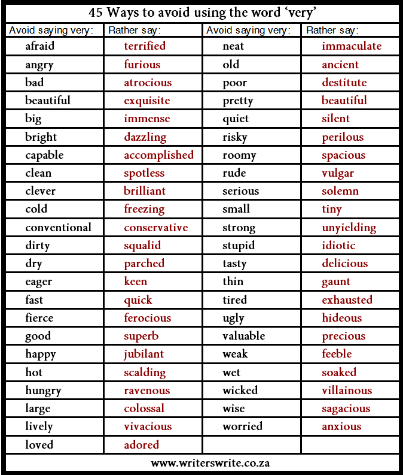

avoid using the word 'very'
=========

@   [english|very]

    'Very' is the most useless word in the English language and can always come out.
    More than useless, 
    it is treacherous because it invariably weakens what it is intended to strengthen. 

